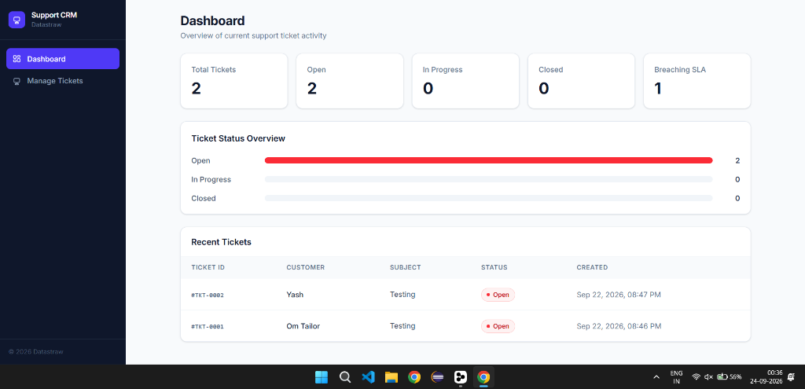
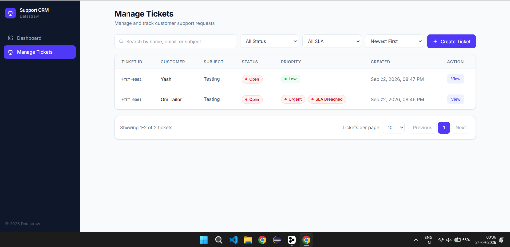
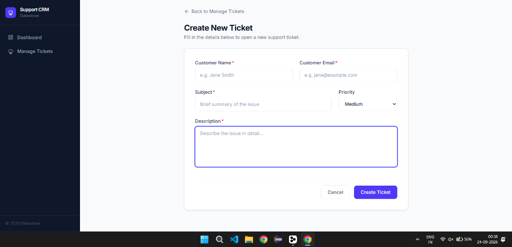
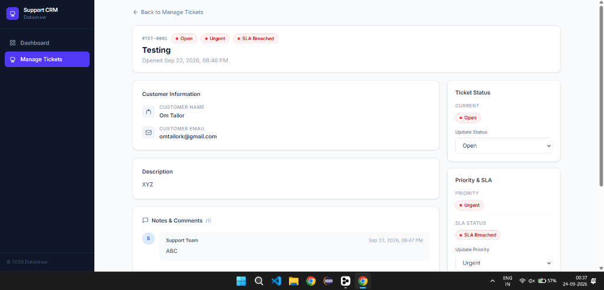

 

<h1>Support CRM</h1>

<strong>A modern customer support ticket management system with SLA tracking and real-time updates.</strong>

  
  
  
  
  

 

📸 Screenshots

 

🎫 Manage Tickets - Searchable ticket list with status/priority filters, SLA breach indicators, and pagination

  

📝 Create Ticket - Form with validation for customer details, subject, description, and priority selection

  

👤 Ticket Detail - Comprehensive view with customer info, status/priority cards, notes timeline, and metadata

  

📊 Dashboard - Overview with ticket statistics and quick actions

 

✨ Features

🎫 Ticket Management

Full CRUD operations for support tickets with auto-generated ticket IDs (TKT-0001 format)

Priority-based SLA tracking with automatic breach detection (Urgent: 4h, High: 24h, Medium: 48h, Low: 72h)

Status workflow management (Open → In Progress → Closed) with real-time updates

Search functionality across ticket ID, customer name, email, and subject

Filtering by status with pagination support

📝 Notes System

Add unlimited notes to any ticket with timestamps

Notes appear in chronological order for complete ticket history

Notes are preserved across status and priority changes

🎯 Priority Management

Four priority levels: Low, Medium, High, Urgent

Automatic priority normalization with validation

Visual SLA breach indicators when tickets exceed response time thresholds

📱 Responsive Design

Mobile-first responsive layout with collapsible sidebar navigation

Desktop-friendly two-column ticket detail view

Touch-friendly interface for mobile support agents

⚡ Performance & Reliability

Efficient database queries with SQLAlchemy ORM

Bulk operations and optimized data fetching

Error handling with user-friendly error messages

Loading states and skeleton screens for better UX

🔐 Tech Stack

Layer

Technology

Backend

FastAPI, SQLAlchemy, Pydantic

Frontend

React 19, Vite, Tailwind CSS 4.3, React Router 7

Database

MySQL (with PyMySQL)

API

RESTful API with CORS support

Development

Hot reload, ESLint, Vite dev server

🚀 Local Setup

Prerequisites

Python 3.8+

Node.js 18+

MySQL 8.0+

1. Clone the repo

git clone https://github.com/yourusername/crm_datastraw.git
cd crm_datastraw

2. Backend setup

cd backend

# Create and activate virtual environment
python -m venv venv
venv\Scripts\activate        # Windows - macOS/Linux: source venv/bin/activate

# Install dependencies
pip install -r requirements.txt

# Create .env file and fill in your values
cp .env.example .env

# Set up your MySQL database and update .env with connection details

# Start the server
uvicorn app.main:app --reload

The API will be available at http://localhost:8000

3. Frontend setup

cd frontend
npm install

# Point the API at your local backend
cp .env.example .env.development
npm run dev

Open http://localhost:5173 to access the application.

Environment Variables

Create a .env file in backend/:

# Database
DB_HOST=localhost
DB_USER=your_db_user
DB_PASSWORD=your_db_password
DB_NAME=crm_datastraw
DB_PORT=3306

# Application
SECRET_KEY=your_secret_key_here
DEBUG=True

And a frontend/.env.development:

VITE_API_BASE_URL=http://localhost:8000

📁 Project Structure

crm_datastraw/
├── backend/                    # FastAPI backend
│   ├── app/
│   │   ├── __init__.py
│   │   ├── main.py            # FastAPI app with CORS
│   │   ├── database.py        # Database connection
│   │   ├── models.py          # SQLAlchemy models (Ticket, Note)
│   │   ├── schemas.py         # Pydantic schemas
│   │   ├── crud.py            # Database operations & SLA logic
│   │   ├── datetime_utils.py  # Date/time utilities
│   │   └── routers/
│   │       ├── __init__.py
│   │       └── tickets.py     # Ticket API endpoints
│   ├── requirements.txt
│   └── .env.example
├── frontend/                   # React frontend
│   ├── src/
│   │   ├── pages/             # Page components
│   │   │   ├── Dashboard.jsx
│   │   │   ├── TicketList.jsx
│   │   │   ├── CreateTicket.jsx
│   │   │   └── TicketDetail.jsx
│   │   ├── components/        # Reusable components
│   │   │   ├── Sidebar.jsx
│   │   │   ├── tickets/       # Ticket-specific components
│   │   │   └── icons.js       # Custom icons
│   │   ├── api/
│   │   │   └── client.js      # API client with error handling
│   │   ├── utils/
│   │   │   └── date.js        # Date formatting utilities
│   │   ├── context/           # React context providers
│   │   ├── App.jsx            # Main app with routing
│   │   └── App.css
│   ├── package.json
│   └── .env.example
└── assets/                    # Screenshots used in this README

⚖️ SLA Logic

Priority

Response Time

Breach Detection

Urgent

4 hours

> 4 hours from creation

High

24 hours

> 24 hours from creation

Medium

48 hours

> 48 hours from creation

Low

72 hours

> 72 hours from creation

SLA breaches are automatically calculated server-side and displayed in the UI with visual indicators. Closed tickets are exempt from SLA calculations.

🎫 Ticket ID Generation

Auto-incrementing ticket IDs in the format TKT-XXXX (e.g., TKT-0001, TKT-0002)

Generated server-side to prevent conflicts

Handles edge cases where existing IDs don't match expected format

🔔 Status Workflow

Status

Description

Open

Newly created ticket, awaiting attention

In Progress

Active work being performed on the ticket

Closed

Ticket resolved and archived

Status changes are logged with timestamps and can trigger SLA breach recalculations.

📦 API Endpoints

Method

Endpoint

Description

GET

/api/

Health check endpoint

GET

/api/tickets

List all tickets with optional filters (status, search)

GET

/api/tickets/{ticket_id}

Get specific ticket with notes

POST

/api/tickets

Create new ticket

PUT

/api/tickets/{ticket_id}

Update ticket (status, priority, notes)

👤 Author

Built with modern web technologies for efficient customer support management.

  Built with ❤️ using FastAPI and React

